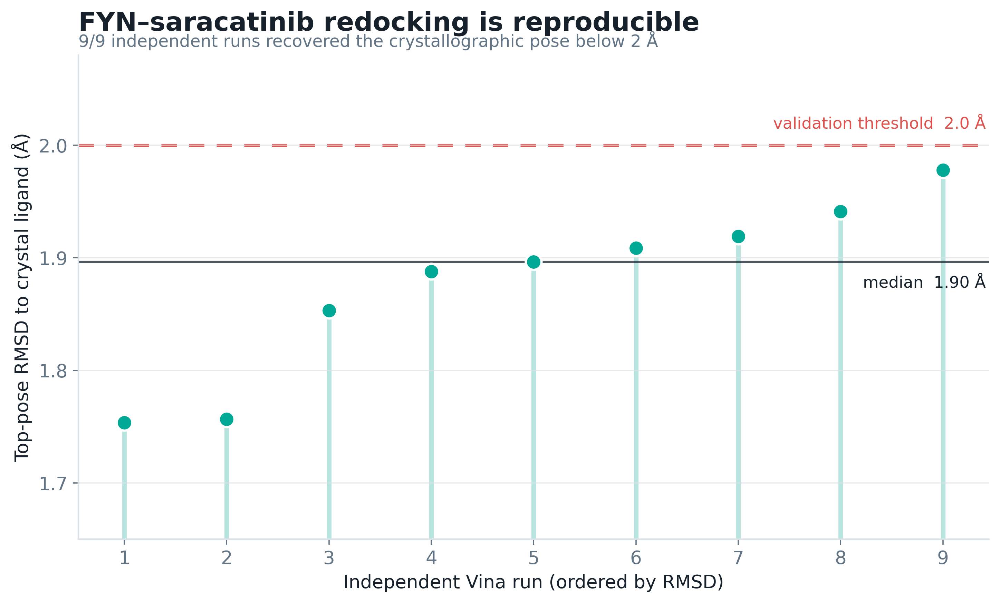
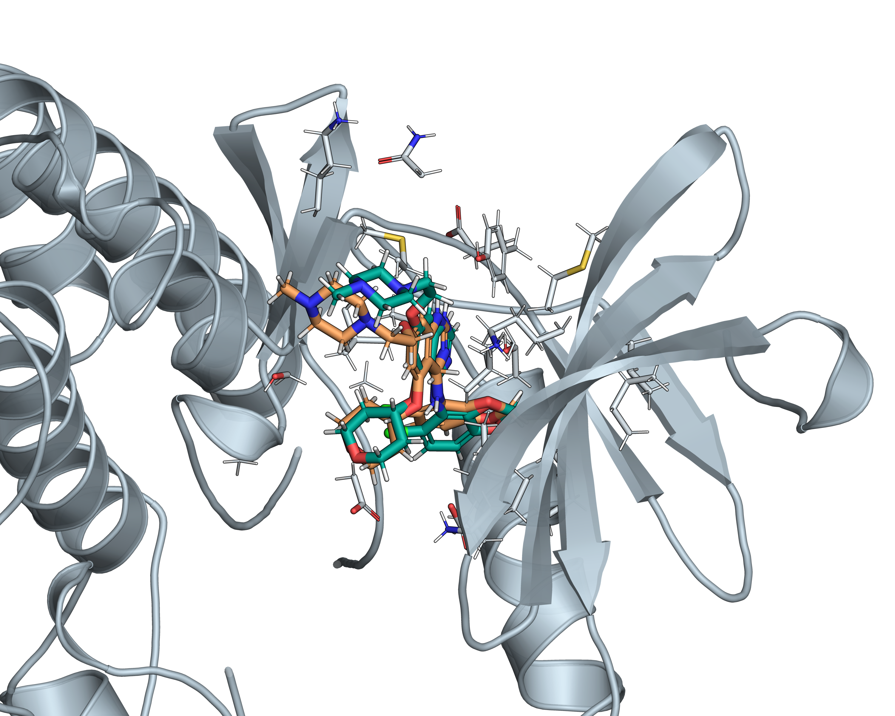
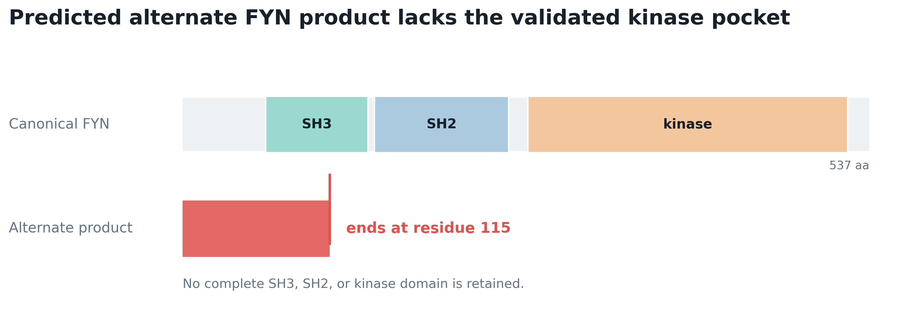
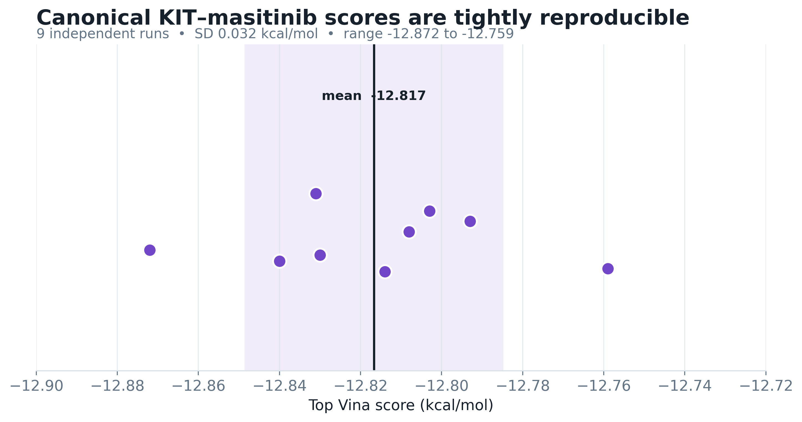
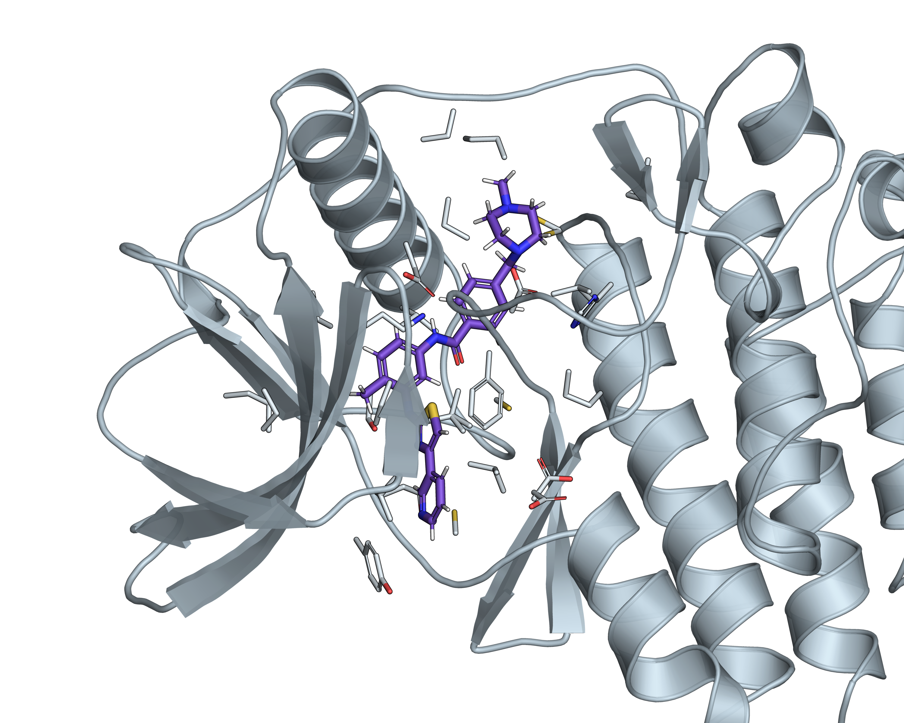
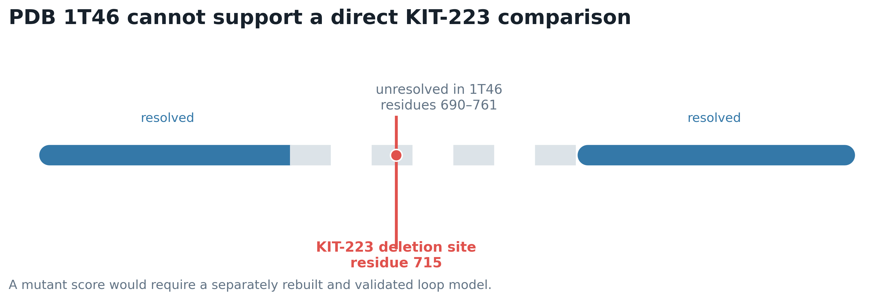

# Preliminary docking analysis: key findings

**Status:** Preliminary computational results  
**Primary result:** successful canonical FYN–saracatinib pose-recovery validation

> **Update:** The expanded all-candidate campaign is reported in `EXPANDED_DOCKING_KEY_FINDINGS.md`. The original CaV1.3 control below used the wrong 8E59 residue (`3PE`, a lipid) because of a ligand-code error. The corrected amiodarone ligand is `BBI A2201`; the corrected results in this document supersede the original CaV1.3 values.

## Executive summary

The strongest result is the FYN–saracatinib redocking experiment. AutoDock Vina repeatedly recovered saracatinib in the experimentally observed FYN binding pocket: all 9 independent runs produced a top-ranked pose below the standard 2 Å RMSD threshold.

The KIT–masitinib calculation was also numerically stable across repeated runs, but it is only a canonical c-KIT baseline. A KIT-223 comparison cannot yet be supported because the altered residue is located in a region missing from the experimental structure.

The corrected CACNA1D/CaV1.3 control recovered a near-native pose only at rank 7, not as the top-ranked pose, and was therefore retained only as an exploratory control.

## 1. FYN–saracatinib is the successful validation example

| Result | Value |
|---|---:|
| Independent runs | 9 |
| Top poses below 2 Å | 9/9 (100%) |
| Mean top-pose RMSD | 1.88 Å |
| Median top-pose RMSD | 1.90 Å |
| Best-recovered top pose | 1.75 Å |
| Mean top-pose Vina score | −9.175 kcal/mol |
| Top-pose score SD | 0.025 kcal/mol |
| Most negative top-pose score | −9.203 kcal/mol |

In plain language, Vina was asked nine separate times to place saracatinib back into the known FYN pocket. Every run placed its highest-ranked pose close to the experimentally observed orientation. This shows that the chosen receptor preparation, ligand preparation, docking box, and search settings can reliably recover this known binding mode.

The best-recovered pose had an RMSD of 1.7535 Å and a Vina score of −9.182 kcal/mol. The most negative score across top poses was −9.203 kcal/mol in a different run, whose RMSD was 1.8879 Å. These values are separated because “best geometry” and “most favorable Vina score” are not necessarily the same pose.

In the molecular overlay, teal is crystallographic saracatinib and orange is the best-recovered Vina pose. Their close overlap is the visual counterpart of the 1.75 Å RMSD result.

### What this result establishes

- The canonical FYN–saracatinib docking setup passes a preliminary cognate-redocking test.
- Pose recovery is reproducible across independent random seeds and multiple exhaustiveness settings.
- The result is strong enough to serve as the successful preliminary example for a presentation.

### What it does not establish

- It does not measure experimental binding affinity.
- It does not prove that saracatinib will be effective in cells or patients.
- It does not by itself demonstrate an Alzheimer’s disease mechanism.
- It does not validate docking to the alternate FYN product.

## 2. The predicted alternate FYN product lacks the drug-binding domain

Canonical FYN is 537 amino acids long and contains SH3, SH2, and kinase domains. The predicted alternate product ends at residue 115. It therefore lacks a complete SH3 domain and has no SH2 or kinase domain.

Saracatinib binds the FYN kinase ATP pocket. Because that domain is absent from the predicted short product, an alternate-protein docking score would not be biologically meaningful. The defensible conclusion is **pocket absent**, not “weak binding.”

The biological relevance of this predicted protein still depends on confirming that the transcript is translated into a stable product.

## 3. KIT–masitinib gives a stable canonical baseline

Masitinib was docked nine times into the experimental c-KIT pocket from PDB 1T46.

| Result | Value |
|---|---:|
| Independent runs | 9 |
| Mean top Vina score | −12.817 kcal/mol |
| Median top Vina score | −12.814 kcal/mol |
| Standard deviation | 0.032 kcal/mol |
| Score range | −12.872 to −12.759 kcal/mol |

The narrow distribution means the computational setup returns nearly the same top score when the stochastic search is repeated. That demonstrates numerical reproducibility for the prepared canonical c-KIT pocket.

However, PDB 1T46 contains crystallographic imatinib, not masitinib. Therefore, this is not a masitinib cognate-redocking validation and the score should not be described as an experimentally confirmed affinity.

## 4. No KIT-223 docking score should be reported yet

KIT-223 differs by deletion of canonical residue 715. In PDB 1T46, residues 690–761 are unresolved. The experimental template therefore does not contain the local structure surrounding the deletion.

Any current KIT-223 model must computationally invent this missing kinase-insert loop. A docking difference could consequently reflect the loop-building method rather than a real effect of the deletion. Early predicted-model docking outputs were excluded for this reason.

The correct presentation statement is:

> Canonical c-KIT docking was reproducible, but an isoform comparison was not performed because the altered residue is unresolved in the experimental template.

## 5. CACNA1D/CaV1.3 corrected control

The initial run mistakenly extracted `3PE`, a phosphatidylethanolamine lipid, instead of amiodarone. PDB 8E59 identifies amiodarone as `BBI A2201`. After correcting the input, the cognate control produced:

- top-ranked pose: −1.041 kcal/mol and 14.95 Å RMSD;
- best near-native pose: rank 7, 1.56 Å RMSD.

Because Vina did not rank the near-native pose first, this is not a successful top-pose validation. Isradipine was therefore retained only as an exploratory shared-pocket control. The resolved CaV1.3 coordinates end before the CACNA1D-214 truncation, so canonical and alternate pocket coordinates are identical in this template.

## 6. Overall conclusions

### Supported conclusions

1. **FYN is the validated preliminary example.** The canonical FYN–saracatinib protocol recovered the crystallographic pose in 9/9 independent runs.
2. **The predicted short FYN product lacks the validated kinase pocket.** This is a structural pocket-loss result, not a numerical affinity comparison.
3. **Canonical KIT–masitinib docking is numerically reproducible.** The nine top scores have a standard deviation of only 0.032 kcal/mol.
4. **KIT-223 remains unresolved.** A locally validated kinase-insert loop model is required before an isoform score can be defended.
5. **CACNA1D is an exploratory shared-pocket control.** The corrected near-native amiodarone pose was rank 7 rather than rank 1, so it should not be presented as a validated affinity result.

### Unsupported conclusions to avoid

- “The docking score equals binding affinity.”
- “Saracatinib is proven to work in Alzheimer’s disease.”
- “KIT-223 binds masitinib more strongly or weakly than canonical KIT.”
- “A missing docking score means zero binding.”
- “A stable score proves the pose is experimentally correct.”

## 7. Recommended presentation wording

For FYN:

> We validated the AutoDock Vina setup by redocking saracatinib into its experimental FYN structure. All nine independent runs recovered a top pose below 2 Å RMSD, with a median of 1.90 Å and a best result of 1.75 Å.

For the alternate FYN product:

> The predicted 115-residue product does not retain the FYN kinase domain, so the validated saracatinib pocket is absent and a conventional docking score would not be meaningful.

For KIT:

> Masitinib docking in the canonical experimental c-KIT pocket was highly reproducible across nine seeds. We do not report a KIT-223 comparison because residue 715 lies in a segment unresolved in the template structure.

For the overall interpretation:

> These results validate one canonical docking protocol and identify structural feasibility limits. They are preliminary computational findings, not measurements of cellular response or clinical efficacy.

## 8. Next experiments needed

1. Confirm translation and stability of the alternate FYN transcript product.
2. Build and locally validate the missing KIT kinase-insert loop around residue 715.
3. Repeat KIT-223 docking only after the altered pocket model passes structural quality checks.
4. Add orthogonal rescoring or interaction-fingerprint analysis after the GNINA CUDA dependency is repaired.
5. Test prioritized predictions experimentally using biochemical or cellular assays.
