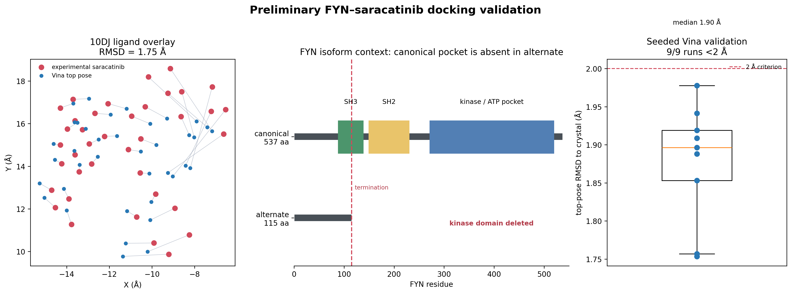
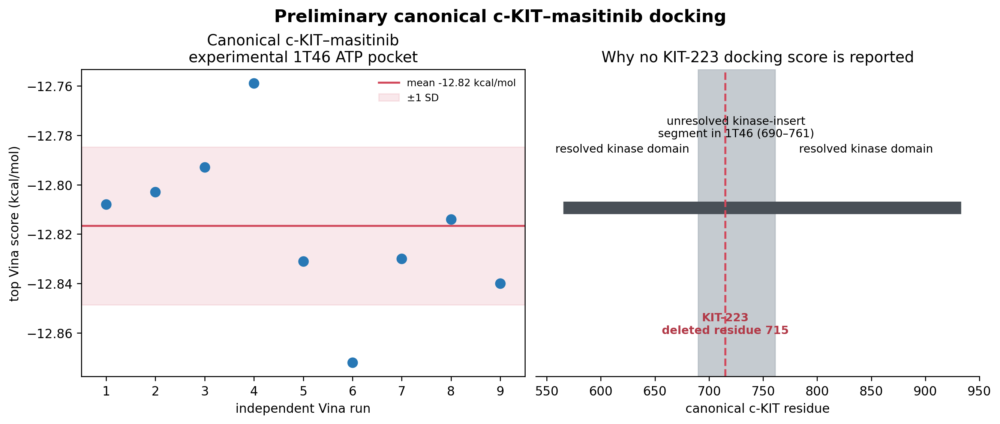

# Wednesday preliminary docking handoff

> **Historical handoff:** This report is superseded by `../KEY_FINDINGS.md` and `../ANALYSIS_PROCESS.md`, which cover all eight candidate rows. The CaV1.3 text below has been corrected after identifying a ligand-code error in the original control.

## Take-home result

The AutoDock Vina workflow has one successful, reproducible crystal-ligand re-docking example: **saracatinib in the canonical FYN kinase domain**. Across 9 independently seeded runs, the top pose was within 2.0 Å of the crystal pose in 9/9 runs (median fixed-frame heavy-atom RMSD 1.90 Å; best 1.75 Å; best Vina score -9.182 kcal/mol). This validates the *canonical FYN* receptor/ligand/grid protocol, not cellular activity or an isoform effect.

## Canonical c-KIT–masitinib baseline

Using the experimental imatinib-bound c-KIT kinase-domain pocket (PDB 1T46), masitinib gave a stable canonical baseline across 9 Vina seeds: mean -12.817 kcal/mol, median -12.814 kcal/mol, SD 0.032 kcal/mol, range -12.872 to -12.759 kcal/mol.

No KIT-223 comparison score is reported. The KIT-223 single-residue deletion is at canonical residue 715, while the relevant kinase-insert segment (residues 690–761) is unresolved in 1T46. A meaningful comparison requires a rebuilt, locally validated loop model; the initial predicted-model pocket runs were therefore excluded rather than over-interpreted.

## Full candidate triage and CACNA1D control

The current AD-enriched coding-isoform data support three candidates from the original list: FYN, KIT, and CACNA1D-214. The remaining proposed comparisons are excluded from quantitative docking in this handoff:

- **GABRA2-206:** not an AD-enriched coding isoform in the available hit table (the matching gene row is GABRA2-202 and is control-enriched).
- **BACE1-476 / BACE1-457:** neither alternate is present in the available hit table, so the expression prerequisite for the proposed comparison is absent.
- **CHRNA7/CHRFAM7A:** no CHRFAM7A transcript/genotype evidence is available here; a mixed-pentamer calculation would be unanchored.
- **PDE9A:** the candidate list does not specify an AD-enriched coding-altered transcript; no such alternate is available to model.

**CACNA1D-214** is AD-enriched and encodes a C-terminally truncated protein (1,625 aa versus canonical 2,161 aa). The experimental human CaV1.3 template 8E59 ends before the truncation, supporting a shared-pocket/pocket-retention interpretation rather than an isoform-specific affinity claim. The original control mistakenly used the `3PE` lipid. The corrected amiodarone ligand (`BBI A2201`) produced a top pose of -1.041 kcal/mol at 14.95 Å RMSD and a near-native rank-7 pose at 1.56 Å. Because the near-native pose was not top ranked, isradipine results remain exploratory.

## Methods to state on Wednesday

- AutoDock Vina scoring; seeded independent runs; 16 CPU cores per run and no remaining concurrent docking jobs.
- FYN validation used human FYN–saracatinib crystal structure PDB 10DJ, chain A; grid center (-11.255, 14.853, -9.445) Å and box 20 × 20 × 26 Å; exhaustiveness 32.
- FYN RMSD is fixed-frame heavy-atom, based on preserved PDBQT atom order and not symmetry-corrected.
- c-KIT results are a canonical-pocket feasibility/baseline result, not a validated protein-isoform affinity comparison.
- The corrected CaV1.3 8E59/amiodarone control found a near-native pose only at rank 7; isradipine is therefore an exploratory shared-pocket control.
- GNINA was staged but cannot currently run because its CUDA binary requires `libcudnn.so.9`; Vina is the reported engine for this preliminary handoff.

## Files

- FYN machine-readable summary: `../../systems/FYN_saracatinib/analysis/summary.json`
- FYN figure (PNG/PDF): `../../systems/FYN_saracatinib/figures/fyn_saracatinib_preliminary.*`
- c-KIT machine-readable summary: `../../systems/KIT_masitinib/analysis/masitinib_1T46_summary.json`
- c-KIT figure (PNG/PDF): `../../systems/KIT_masitinib/figures/kit_masitinib_preliminary.*`
- CaV1.3 corrected staging and control: `../../systems/CACNA1D_isradipine/prepared/stage_metadata.json` and `../../systems/CACNA1D_isradipine/runs/amiodarone_corrected_seed20260825_ex32/result.json`

## Next defensible analysis

1. Build and validate a KIT kinase-insert loop model that explicitly includes residue 715 before attempting KIT-223 docking.
2. Prepare an explicit canonical/alternate FYN structural comparison only after confirming the alternate transcript’s translated product and biological relevance.
3. Add BACE1, CHRFAM7A, GABRA2-206, or PDE9A only after their required alternate transcript/genotype evidence is supplied.
4. If the CUDA/cuDNN environment is repaired, rescore retained Vina poses with GNINA CNNscore/CNNaffinity as an orthogonal ranking, while retaining Vina redocking as the pose-validation benchmark.
